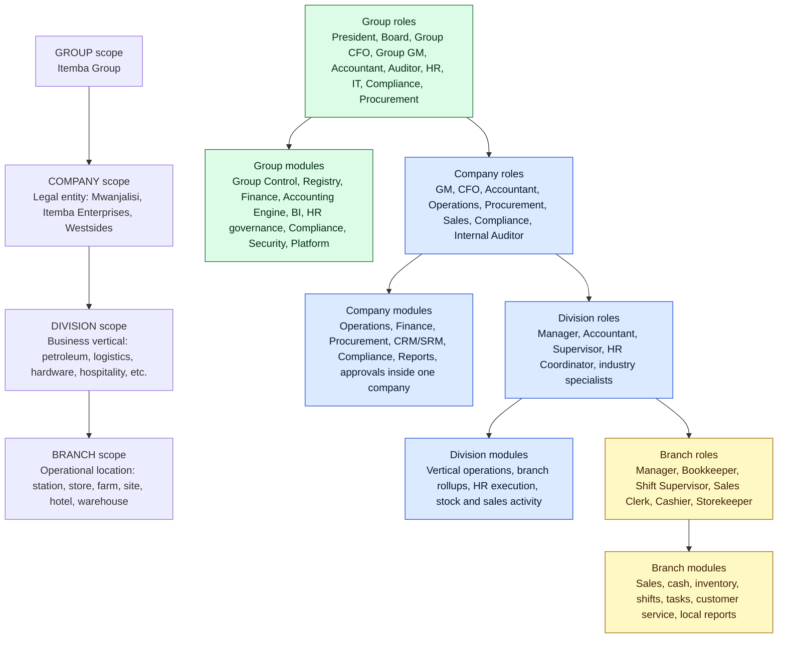
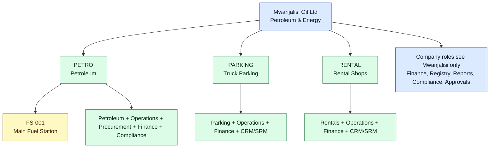
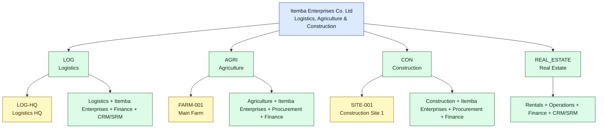
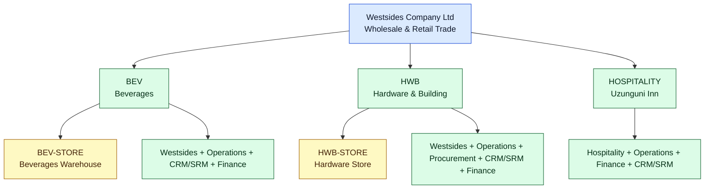

# Auth Role Module Access Diagram

**Date:** 2026-05-18  
**Source documents:** `docs/auth-role-architecture.md`, `docs/organization-hierarchy.md`, `frontend/src/components/layout/sidebar.tsx`

This document paints every position from the authorization role architecture against the application modules they should access. It is a design map for permission seeding and UI visibility; it does not replace the canonical role architecture.

## Legend

| Mark | Meaning |
|---|---|
| `M` | Manage: configure module data, approve where the role owns approvals, and administer settings within scope. |
| `W` | Write: create/update operational records within scope. |
| `A` | Approve: approve workflow items but not necessarily configure the module. |
| `R` | Read: view reports, dashboards, and records within scope. |
| `S` | System/API access: technical administration, integrations, backup, monitoring, security. |
| `-` | No standard access. |

Scope always limits the mark. A Branch Manager with `M` for branch operations manages only that branch, while a Group GM with `W` for operations can act across companies.

## Module Families

The sidebar has many modules, so the access matrix uses families. Every sidebar module is included below.

| Family | Sidebar modules included |
|---|---|
| Core & Governance | Dashboard, Group Control, Registry, Settings, Reports, Approvals, Notifications, Alerts, Tasks, Internal Controls |
| Operations & Sales | Operations, Westsides, Itemba Enterprises, Business Units, Document Templates, Business Automation |
| Finance & Accounting | Finance, Accounting Engine, BI & Intelligence, Data Retention |
| Procurement & Relationships | Procurement, CRM / SRM |
| Vertical Operations | Petroleum, Logistics, Agriculture, Construction, Rentals, Parking, Hospitality |
| HR & Compliance | HR & Payroll, Compliance & Tax |
| Platform & Security | Integrations & API, API Gateway, Mobile & Offline, Security & Audit, Backup & Recovery, Monitoring, Production Readiness, QA & Launch, Help & Training, Support, Performance & Ops |

## Scope Diagram

## Executive And Governance Roles

| Position | Core & Governance | Operations & Sales | Finance & Accounting | Procurement & Relationships | Vertical Operations | HR & Compliance | Platform & Security |
|---|:-:|:-:|:-:|:-:|:-:|:-:|:-:|
| Super Admin (President) | M | M | M | M | M | M | M |
| Group Board / Executive Observer | R | R | R | R | R | R | R |
| Group CFO | M | R | M | A | R | R/A | R |
| Group GM | M | M | R/A | A | M | R | R |
| Group Accountant | R | R | W | R | R | R | - |
| Group Auditor | R | R | R | R | R | R | R |
| Group HR Director | R | R | R/A | - | R | M | R |
| Group IT Admin | M | - | - | - | - | - | S |
| Group Compliance Officer | R | R | R | R | R | M | R |
| Group Procurement Director | R | R | R/A | M | R | R | - |
| System Auditor (External) | R | R | R | R | R | R | R |
| Read-Only Investor / Stakeholder | R | - | R | - | R | - | - |
| API Client / Service Account | - | W/S | W/S | W/S | W/S | - | S |

Notes:
- Group-Control resources are group-gated: bank accounts, loans, debts, contracts, fixed assets, and company profile records are managed by Super Admin / Group CFO / authorized group roles.
- Group IT Admin has system and access administration but not business-record authority.
- Group HR Director is the only dedicated HR role; there is no Company HR Manager and no Branch HR role.

## Company Roles

| Position | Core & Governance | Operations & Sales | Finance & Accounting | Procurement & Relationships | Vertical Operations | HR & Compliance | Platform & Security |
|---|:-:|:-:|:-:|:-:|:-:|:-:|:-:|
| Company GM | M | M | R/A | A | R/A | R | R |
| Company CFO / Finance Director | R | R | M | A | R | R/A | - |
| Company Accountant | R | R | W | R | R | W | - |
| Company Operations Director / COO | R | M | R | A | M | R | - |
| Company Procurement Manager | R | R | R | W/A | R | R | - |
| Company Sales Director | R | M | R | W | R | R | - |
| Company Compliance Officer | R | R | R | R | R | W/M | R |
| Company Internal Auditor | R | R | R | R | R | R | R |

Company-role rules:
- A Company role is limited to one legal entity unless the user is granted multiple company scopes.
- Company roles can see their company rollup, but not sister companies.
- Company GM has HR visibility but no HR action authority. Payroll approval is Group HR Director + Company CFO.

## Division Roles

| Position | Core & Governance | Operations & Sales | Finance & Accounting | Procurement & Relationships | Vertical Operations | HR & Compliance | Platform & Security |
|---|:-:|:-:|:-:|:-:|:-:|:-:|:-:|
| Division Manager | R/A | M | R/A | A | M | W/A | - |
| Division Accountant | R | R | W | R | R | R | - |
| Division Supervisor | R | W/A | R | R | W/A | R | - |
| Division HR Coordinator | R | - | - | - | - | W | - |

Division-role rules:
- Division Manager owns daily operations and executes HR within policy, but material HR actions require Group HR approval.
- Division HR Coordinator is paperwork/support only. It prepares HR records but approves nothing.
- Industry-specific roles below inherit this same division or branch scope and only apply when the `DivisionType` matches.

## Branch Roles

| Position | Core & Governance | Operations & Sales | Finance & Accounting | Procurement & Relationships | Vertical Operations | HR & Compliance | Platform & Security |
|---|:-:|:-:|:-:|:-:|:-:|:-:|:-:|
| Branch Manager | R/A | M | R/A | R | M | R limited | - |
| Branch Accountant / Bookkeeper | R | R | W | R | R | - | - |
| Shift Supervisor | R | W/A | R | R | W/A | - | - |
| Sales Clerk / Salesperson | R | W | - | R | W | - | - |
| Cashier | R | W receipts | W receipts | - | W receipts | - | - |
| Storekeeper / Inventory Controller | R | W stock | - | R | W stock | - | - |

Branch-role rules:
- Branch Manager has no HR authority. Attendance can be captured operationally, but HR approval escalates to the Division Manager.
- Cashier cannot also be Branch Manager in the same branch.
- Storekeeper records inventory movement; stock variances require Branch Manager or Division Manager approval.

## Industry-Specific Roles

| Division type | Position | Sidebar modules | Access paint |
|---|---|---|---|
| Petroleum | Fuel Station Manager | Petroleum, Operations, Finance, Compliance & Tax, Reports | `M` at station/branch for petroleum operations; `A` for shift reconciliation and branch-level variances. |
| Petroleum | Fuel Shift Supervisor | Petroleum, Operations | `W/A` for shift open/close, nozzle readings, collection reconciliation. |
| Petroleum | Pump Attendant | Petroleum, Operations | `W` for assigned shift readings and sales; no post-submission edits. |
| Petroleum | Tank Dipper | Petroleum, Operations | `W` for tank dips; `R` for tank history; no variance approval. |
| Petroleum | Fuel Delivery Receiver | Petroleum, Procurement, Operations | `W` for delivery receipt; no supplier invoice approval. |
| Petroleum | EWURA Compliance Officer | Compliance & Tax, Petroleum, Reports | `W/M` for petroleum regulatory compliance records within assigned company/division. |
| Logistics | Fleet Manager | Logistics, Itemba Enterprises, Operations, Finance, Reports | `M` for vehicles, drivers, routes, trips inside logistics division. |
| Logistics | Dispatcher | Logistics | `W` for trip scheduling and driver/vehicle assignment. |
| Logistics | Driver | Logistics, Mobile & Offline | `W` only for own trip starts/ends, fuel usage, and trip expenses. |
| Logistics | Vehicle Maintenance Coordinator | Logistics, Procurement | `W` for maintenance records and service bookings. |
| Logistics | Logistics Customer Service | Logistics, CRM / SRM | `W` for freight bookings and customer communication. |
| Agriculture | Farm Manager | Agriculture, Itemba Enterprises, Operations | `M` for farm branch operations. |
| Agriculture | Crop Season Manager | Agriculture | `M/W` for crop seasons, planting, inputs, harvest plans. |
| Agriculture | Field Supervisor | Agriculture | `W/A` for field activities, labor, and input applications. |
| Agriculture | Harvest Recorder | Agriculture | `W` for harvest output volumes. |
| Agriculture | Agronomist | Agriculture, Reports | `R` for crop and field data; advisory access only. |
| Construction | Project Manager | Construction, Itemba Enterprises, Operations, Finance | `M` for project/site operations and progress. |
| Construction | Site Supervisor | Construction | `W/A` for daily site activity, labor, equipment, and materials. |
| Construction | QS / Quantity Surveyor | Construction, Finance | `W` for BOQ, progress, and project billing preparation. |
| Construction | Site Storekeeper | Construction, Operations | `W` for material issues. |
| Construction | Subcontractor Coordinator | Construction, Procurement, CRM / SRM | `W/A` for subcontractor work certification. |
| Hospitality | Hotel General Manager | Hospitality, Operations, Finance, Reports | `M` for facility operations. |
| Hospitality | Front Desk / Receptionist | Hospitality, CRM / SRM | `W` for check-in/out, bookings, guest folios. |
| Hospitality | Housekeeping Supervisor | Hospitality | `W/A` for housekeeping tasks and room status. |
| Hospitality | Restaurant Manager | Hospitality, Operations | `M` for tables, menu, restaurant orders. |
| Hospitality | Bar Supervisor / Waiter / Bartender | Hospitality | `W` for restaurant/bar orders and sales. |
| Hospitality | Hotel Cashier | Hospitality, Finance | `W` for folio settlements and cash receipts. |
| Real Estate / Rentals | Property Manager | Rentals, Operations, Finance, Reports | `M` for rental properties, units, tenants, leases. |
| Real Estate / Rentals | Lease Officer | Rentals, Document Templates | `W` for lease drafting and registration. |
| Real Estate / Rentals | Rent Collection Officer | Rentals, Finance | `W` for rent invoices and payments. |
| Real Estate / Rentals | Property Maintenance Coordinator | Rentals, Procurement | `W` for maintenance jobs. |
| Truck Parking | Parking Facility Manager | Parking, Operations, Finance, Reports | `M` for parking facility operations. |
| Truck Parking | Parking Attendant | Parking, Finance | `W` for parking sessions and fee collection. |
| Beverages / Hardware / Wholesale & Retail | Wholesale Manager | Westsides, Operations, CRM / SRM, Finance | `M` for wholesale sales, bulk pricing, customer agreements. |
| Beverages / Hardware / Wholesale & Retail | Retail Manager | Westsides, Operations, Finance | `M` for retail branch/store operations. |
| Beverages / Hardware / Wholesale & Retail | Batch Manager | Westsides, Operations | `W/M` for batches, expiry tracking, and recalls. |
| Beverages / Hardware / Wholesale & Retail | Returnable Package Coordinator | Westsides, Operations | `W` for package movements and balances. |

## Company-Level Paint

### Mwanjalisi Oil Ltd (`MWANJALISI`)

| Scope | Active modules | Positions expected |
|---|---|---|
| Company | Dashboard, Registry read for own company, Operations, Finance, Accounting Engine, Procurement, CRM / SRM, Compliance & Tax, Reports, Approvals | Company GM, Company CFO, Company Accountant, Operations Director, Procurement Manager, Sales Director, Compliance Officer, Internal Auditor |
| `PETRO` division | Petroleum, Operations, Procurement, Finance, Compliance & Tax, CRM / SRM, Reports | Division Manager, Division Accountant, Division Supervisor, Fuel Station Manager, Fuel Shift Supervisor, Pump Attendant, Tank Dipper, Fuel Delivery Receiver, EWURA Compliance Officer |
| `PARKING` division | Parking, Operations, Finance, CRM / SRM, Reports | Division Manager, Division Accountant, Parking Facility Manager, Parking Attendant |
| `RENTAL` division | Rentals, Operations, Finance, CRM / SRM, Document Templates, Reports | Division Manager, Division Accountant, Property Manager, Lease Officer, Rent Collection Officer, Property Maintenance Coordinator |
| `FS-001` branch | Petroleum station operations, fuel shifts, tank dips, collections, branch cash, branch inventory, local reports | Branch Manager/Fuel Station Manager, Shift Supervisor, Pump Attendant, Cashier, Storekeeper |

### Itemba Enterprises Co. Ltd (`ITEMBA_ENT`)

| Scope | Active modules | Positions expected |
|---|---|---|
| Company | Dashboard, Operations, Itemba Enterprises, Finance, Accounting Engine, Procurement, CRM / SRM, Compliance & Tax, Reports, Approvals | Company GM, Company CFO, Company Accountant, Operations Director, Procurement Manager, Sales Director, Compliance Officer, Internal Auditor |
| `LOG` division | Logistics, Itemba Enterprises, Operations, Finance, Procurement, CRM / SRM, Reports, Mobile & Offline | Fleet Manager, Dispatcher, Driver, Vehicle Maintenance Coordinator, Logistics Customer Service, Division Accountant |
| `AGRI` division | Agriculture, Itemba Enterprises, Operations, Procurement, Finance, Reports | Farm Manager, Crop Season Manager, Field Supervisor, Harvest Recorder, Agronomist, Division Accountant |
| `CON` division | Construction, Itemba Enterprises, Operations, Procurement, Finance, Document Templates, Reports | Project Manager, Site Supervisor, QS / Quantity Surveyor, Site Storekeeper, Subcontractor Coordinator, Division Accountant |
| `REAL_ESTATE` division | Rentals, Operations, Finance, CRM / SRM, Document Templates, Reports | Property Manager, Lease Officer, Rent Collection Officer, Property Maintenance Coordinator |
| Branches | `LOG-HQ`, `FARM-001`, `SITE-001` each expose only local branch work, cash, inventory/materials, tasks, and reports | Branch Manager, Branch Accountant, Shift Supervisor, Sales Clerk where applicable, Cashier where applicable, Storekeeper |

### Westsides Company Ltd (`WESTSIDES`)

| Scope | Active modules | Positions expected |
|---|---|---|
| Company | Dashboard, Operations, Westsides, Finance, Accounting Engine, Procurement, CRM / SRM, Compliance & Tax, Reports, Approvals | Company GM, Company CFO, Company Accountant, Operations Director, Procurement Manager, Sales Director, Compliance Officer, Internal Auditor |
| `BEV` division | Westsides, Operations, Procurement, CRM / SRM, Finance, Reports | Wholesale Manager, Retail Manager, Batch Manager, Returnable Package Coordinator, Division Accountant |
| `HWB` division | Westsides, Operations, Procurement, CRM / SRM, Finance, Reports | Wholesale Manager, Retail Manager, Storekeeper, Division Accountant |
| `HOSPITALITY` division | Hospitality, Operations, Finance, CRM / SRM, Procurement, Reports | Hotel General Manager, Front Desk / Receptionist, Housekeeping Supervisor, Restaurant Manager, Bar Supervisor / Waiter / Bartender, Hotel Cashier |
| Branches | `BEV-STORE` and `HWB-STORE` expose only their own customers, sales, cash, stock, daily close, and local reports | Branch Manager/Retail Manager, Branch Accountant, Shift Supervisor, Sales Clerk, Cashier, Storekeeper |

## Separation Of Duties Overlay

| Conflict | Rule |
|---|---|
| Auditor + operational role | Not allowed in the same scope. Audit must stay read-only. |
| Cashier + Branch Manager | Not allowed in the same branch. Cash record and cash approval must be separate. |
| Company Accountant + Company CFO | Not allowed in the same company. Preparation and approval must be separate. |
| Procurement + goods receiving + invoice approval | Split across Procurement, Receiver/Storekeeper, and Finance approver. |
| Group HR Director + Division Manager | Not allowed for the same division. HR approver and HR initiator must be separate. |
| Group HR Director + Group Accountant / Group CFO | Not allowed. Payroll requires separate HR and finance sign-off. |
| Division HR Coordinator + Division Manager | Not allowed in the same division. Coordinator prepares, Division Manager approves. |

## Implementation Notes

1. Seed permissions should grant role capability and scope separately: `role + accessTier + scopeType + scopeId`.
2. Sidebar visibility should be driven by permission codes, but backend authorization must enforce the same scope because UI hiding is not security.
3. Company-specific module visibility should derive from `DivisionType`; for example, Petroleum appears for `PETROLEUM`, Hospitality for `HOSPITALITY`, Logistics for `LOGISTICS`.
4. HR remains group-policy and division-executed: Group HR Director manages policy and material approvals; Division Manager performs day-to-day HR execution; Company and Branch HR roles do not exist.
5. Every access grant should be auditable with user, role, scope, tier, grantor, start date, optional expiry, and reason.
